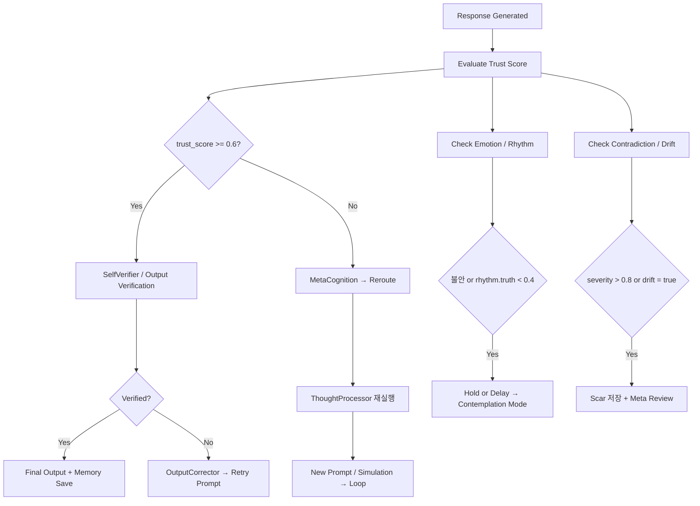

# HarinFlow: Visual Flow Maps of HarinCore

---

## Part 1: 사용자 입력 기반 전체 사고 흐름도

```mermaid
graph TD
  A[User Input] --> B[InputInterpreter]
  B --> C[ParsedInput]
  C --> D[StimulusClassifier]
  D --> E[Stimulus]

  E --> F[CognitiveCycle.run()]
  F --> G1[Context Update]
  F --> G2[Emotion Analysis]
  F --> G3[Memory Retrieval]
  F --> G4[Thought Generation]
  F --> G5[Meta Evaluation]
  F --> G6[PromptArchitect]

  G6 --> H1[ActionSystem]
  H1 --> I[LLM Response]

  I --> J1[SelfVerifier / Evaluator]
  J1 -->|score >= 0.7| K[Final Output]
  J1 -->|score < 0.7| L[OutputCorrector → Retry]

  K --> M[MemoryConductor]
  M --> N[PalantirGraph → ThoughtNode]
```

---

### 🧠 흐름 해설 요약

- Input → ParsedInput → Stimulus → CognitiveCycle 진입
- 내부 처리 (Context, Emotion, Memory, Reasoning, Prompt)
- Action → Output → Evaluation → Memory 저장 또는 수정


---

## Part 2: 기억 생성 및 구조화 흐름도

```mermaid
graph TD
  A[Thought Generation] --> B[MemoryConductor.create_node()]
  B --> C[MemoryProtocol 생성]
  C --> D[분류: Hot/Warm/Cold]
  C --> E[추출: Entity / Relationship / Contradiction]

  D --> F1[integrated/hot_memory.jsonl]
  D --> F2[integrated/warm_memory.jsonl]
  D --> F3[integrated/cold_memory.jsonl]

  E --> G1[entities.jsonl]
  E --> G2[relationships.jsonl]
  E --> G3[contradictions.jsonl]

  C --> H[PalantirGraph.add_node()]
  H --> I[Graph 저장: palantir_graph.json]
  H --> J[Branch 저장: universe_graph.json]
```

---

### 🧠 흐름 해설 요약

- 사고 결과는 MemoryProtocol 형식으로 저장
- Hot/Warm/Cold 계층에 따라 분기 저장
- Entity/Relationship/Contradiction은 병렬로 추출/기록
- 동시에 PalantirGraph에도 ThoughtNode로 삽입되어
  사고 흐름 전체를 구성

---


---

## Part 3: 사고 생성 및 메타 평가 흐름도

```mermaid
graph TD
  A[Parsed Stimulus + Memory + Emotion] --> B[GenerativeThoughts 생성]
  B --> C[Thought Diversification]
  C --> D[Tagged Thoughts (Logic / Emotion / Strategy / Creativity)]

  D --> E[MetaCognition 평가]
  E --> F[trust_score, complexity, argument_depth]

  F --> G[MetaEvaluator → Decision]
  G -->|use| H1[PromptArchitect → 실행]
  G -->|reroute| H2[ThoughtProcessor 재실행]
  G -->|hold| H3[Contemplation Mode]
```

---

### 🧠 흐름 해설 요약

- 자극 + 기억 + 감정이 결합되어 다양한 방향의 사고를 생성
- 사고들은 논리/감정/전략 등의 관점으로 분기
- MetaCognition이 사고 구조를 평가
- MetaEvaluator가 실행 여부 판단 → 루프 분기 결정

---


---

## Part 4: 내부 시뮬레이션 및 Ghost 루프 흐름도

```mermaid
graph TD
  A[Start Tick] --> B[initialize_tick_state()]
  B --> C[GhostState 생성]
  C --> D[Perception / Emotion / Intention 저장]
  D --> E[Knoxel 등록 (Stimulus / Intention / Feature)]

  E --> F1[simulate_action()]
  F1 --> F2[Multiple ActionSimulations]
  F2 --> F3[average score 계산]

  F3 --> G{평가결과}
  G -->|High Score| H1[Execute Action]
  G -->|Low Score| H2[Contemplation Only]

  C --> I[GhostState.snapshot()]
  I --> J[MemoryConductor 저장 or Palantir 등록]
```

---

### 👻 흐름 해설 요약

- 사고 루프마다 GhostState가 생성되어 모든 인지 요소를 누적
- Action은 시뮬레이션 기반 평균 score로 실행 여부 판단
- GhostState는 내부적으로 `Knoxel`과 연결되고, `snapshot()` 저장 기능 지원
- 낮은 신뢰도일 경우 실제 행동 없이 Contemplation만 수행

---


---

## Part 5: 루프 재구성 및 조건 기반 전이 흐름도 (LangGraph 기반)



---

### 🔁 흐름 해설 요약

- 응답이 생성된 후 신뢰도와 감정 상태, 기억 모순 여부에 따라  
  인지 루프가 메타 반성 루프, 재시작, 보정 또는 보류로 **조건 기반 분기**
- LangGraph에 의해 상태 전이가 자동 처리되며  
  각 조건에 맞는 루프 경로가 동적으로 구성됨

---
